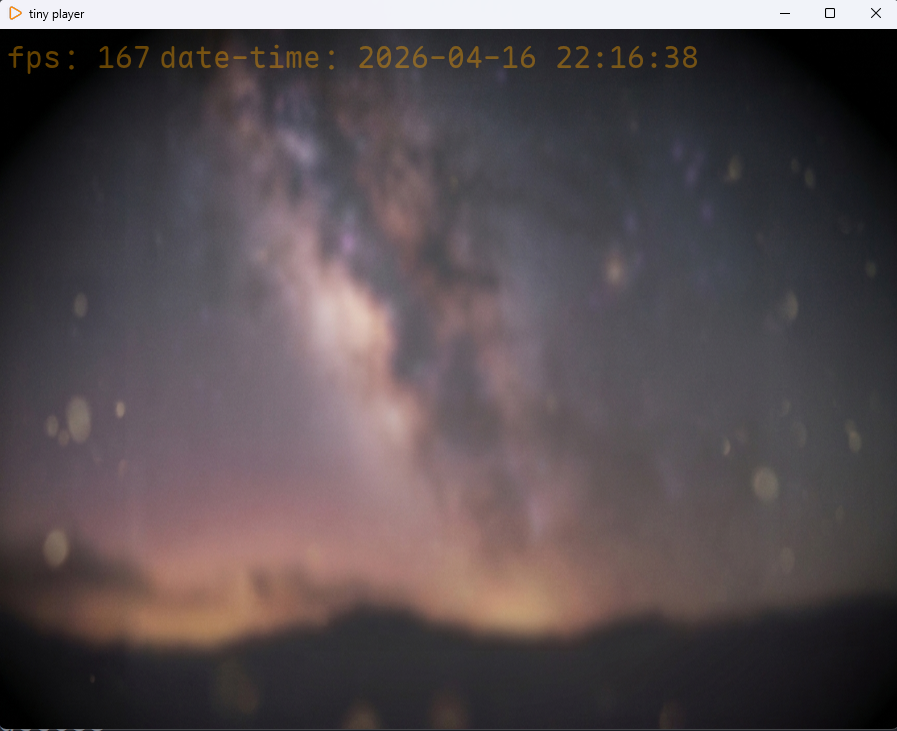

# tiny-player

> **A lightweight, high-performance multimedia player built with Rust.**

`tiny-player` is a multimedia player designed for simplicity and efficiency. By combining the memory safety of Rust, the robust decoding power of FFmpeg, and high-speed GPU rendering, it provides a fluid and seamless playback experience with a minimal footprint.

---

## ✨ Key Features

* **Ultra-Lightweight**: Minimalist design with extremely low system resource consumption.
* **Blazing Fast Performance**:
    * **Native Rust**: Built from the ground up in Rust for maximum speed and memory safety.
    * **Industry-Leading Decoding**: Powered by [FFmpeg](https://github.com/FFmpeg/FFmpeg) (via [ffmpeg-the-third](https://github.com/shssoichiro/ffmpeg-the-third)) for universal format support.
    * **Hardware Acceleration**: Utilizes [wgpu](https://github.com/gfx-rs/wgpu) with a **Vulkan** backend for low-latency, direct GPU rendering.
* **Modern UI**: Responsive and clean interface built with the [egui](https://github.com/emilk/egui) framework.
* **Open Source**: Fully transparent codebase, allowing you to modify and build your own custom version under the project license.

---

## 🛠️ Tech Stack

* **Language**: Rust
* **UI Framework**: [egui](https://github.com/emilk/egui)
* **Decoding Engine**: [FFmpeg](https://github.com/FFmpeg/FFmpeg)
* **Rendering API**: [wgpu](https://github.com/gfx-rs/wgpu) (Supporting Vulkan, Metal, and DirectX)

---

## 🚀 Getting Started

Currently, `tiny-player` is optimized for **Windows**.

### Installation
1. Download the latest `tiny-player-setup.exe` from the Releases page.
2. Run the installer and follow the on-screen instructions.
3. Launch the application via the `tiny-player.exe` shortcut on your desktop.

### How to Use
1. Click the **File** button on the main interface.
2. Select a media file (standard formats like `.mp4` or `.mkv` are recommended).
3. Click **Open**, then hit the **Play** button (there are more ways to open a media file).
4. Use the on-screen **Control Widgets** to manage playback progress and volume.

---

## 💡 Performance Tips

If you are using a laptop and experience low frame rates:
* Go to `Settings -> System -> Display -> Graphics` and set `tiny-player` to **"High Performance"**.
* Ensure your Windows power mode is set to **"Best Performance"** or **"Balanced"** to allow the CPU to maintain higher clock speeds.

---

## 📄 License

This project is licensed under the GPLv2 License. See the [LICENSE](./LICENSE) file for more details. This license is chosen for balance and justice.

---

## 🤝 Contributing

Contributions, issues, and feature requests are welcome! Feel free to check the issues page if you want to help. PR is always welcome. The project is currently NOT for commercial use. If you find this project useful, please give it a **Star**! 🌟